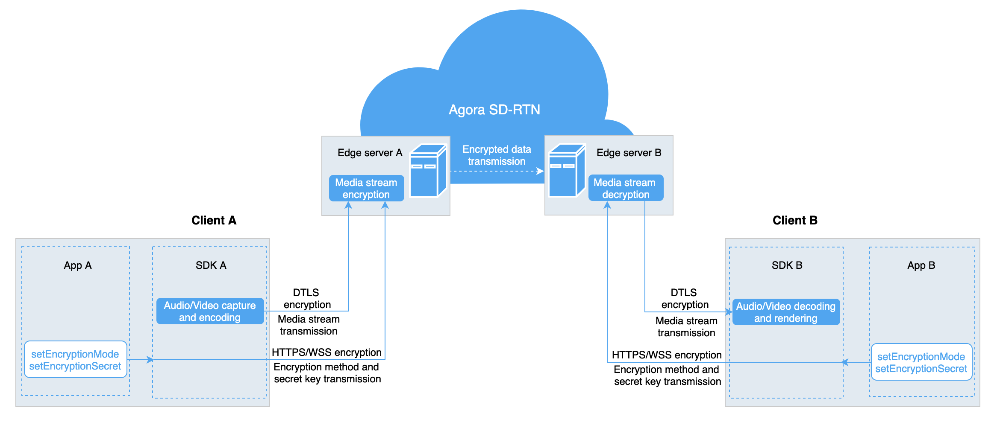

## Introduction

Agora supports channel encryption.

The following figure shows how the Agora SDK uses built-in channel encryption:



> - Both the communication and live-broadcast scenarios support channel encryption. If you need to push streams to CDN in a live broadcast, do not enable channel encryption.
> - Ensure that both the receivers and the senders use channel encryption; otherwise, your users may encounter unexpected behaviors such as no audio or a black screen.

## Implementation

Before proceeding, ensure that you have implemented the basic real-time communication functions in your project. For details, see [Implement a Basic Video Call](basic_call.md).

The `client` object in the following sample code is created by calling `AgoraRTC.createClient`.

```js
// Sets encryption mode as "aes-128-xts", "aes-256-xts", or "aes-128-ecb".
// Set the encryption password.
client.setEncryptionConfig(encryptionMode, password);
```

### API reference
- [`AgoraRTCClient.setEncryptionConfig`](/api/en/interfaces/iagorartcclient.html#setencryptionconfig)

## Considerations
Call `AgoraRTCClient.setEncryptionConfig` before joining a channel.

